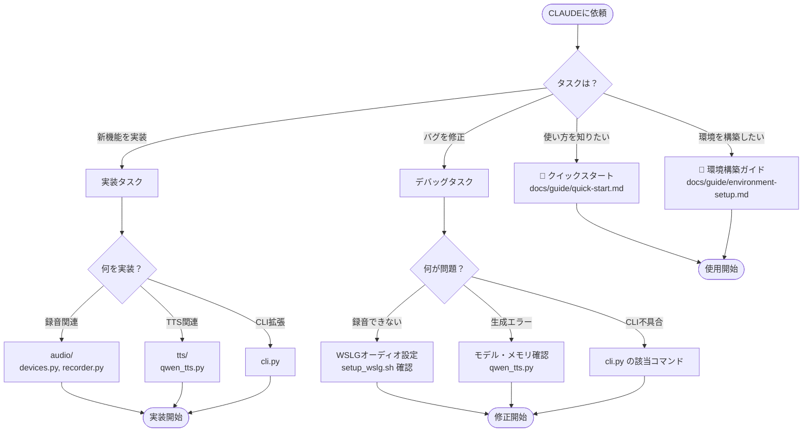

# CLAUDE.md – Voice Clone プロジェクトガイド

## ⚡ TL;DR - 目的別クイックナビゲーション

目的に応じて以下のセクションへジャンプしてください：

| 目的                       | 参照先                                                            | 所要時間 |
| -------------------------- | ----------------------------------------------------------------- | -------- |
| **ツールを使いたい**       | [docs/guide/quick-start.md](./docs/guide/quick-start.md)          | 5 分     |
| **環境構築**               | [docs/guide/environment-setup.md](./docs/guide/environment-setup.md) | 15 分    |
| **新機能の実装**           | [🏗 プロジェクト構造](#-プロジェクト構造) → 該当モジュール        | 10 分    |
| **バグ修正・デバッグ**     | [🔧 主要コマンド](#-主要コマンド) → [📁 コード構成](#-コード構成) | 10 分    |
| **技術仕様の確認**         | [📚 技術スタック](#-技術スタック)                                 | 5 分     |

### 決定木



---

## 🗣 言語設定

- 回答は **基本的に日本語** でお願いします
- ただし、コード中のコメントや技術用語については英語のままで構いません

---

## 📖 概要

Qwen3-TTS を使用した音声クローンプロジェクト。
WSLGで録音し、任意のテキストを指定した声で読み上げた音声ファイルを生成する。

---

## 📚 技術スタック

| カテゴリ         | 技術                                              |
| ---------------- | ------------------------------------------------- |
| 言語             | Python 3.10+                                      |
| TTSモデル        | Qwen3-TTS（Qwen/Qwen3-TTS-12Hz-0.6B）             |
| CLI              | click                                             |
| オーディオ       | sounddevice / soundfile                           |
| 深層学習         | transformers / torch                              |
| UI装飾           | rich                                              |

### 動作要件

- **OS**: Windows 10/11 + WSL2（WSLg有効）
- **RAM**: 16GB 推奨
- **GPU**: オプション（CUDAサポート、CPUでも動作可能）

---

## 🏗 プロジェクト構造

```
voice-clone/
├── CLAUDE.md              # このファイル（AI向けガイド）
├── README.md              # プロジェクト説明
├── pyproject.toml         # パッケージ設定
├── setup_wslg.sh          # WSLGオーディオセットアップ
├── docs/
│   └── guide/
│       ├── quick-start.md       # クイックスタート
│       └── environment-setup.md # 環境構築
├── src/voice_clone/
│   ├── __init__.py
│   ├── cli.py             # CLIエントリポイント
│   ├── config.py          # 設定管理
│   ├── audio/
│   │   ├── devices.py     # デバイス管理
│   │   └── recorder.py    # 録音機能
│   └── tts/
│       └── qwen_tts.py    # Qwen3-TTSラッパー
├── samples/               # 入力音声サンプル
└── outputs/               # 生成音声出力
```

---

## 📁 コード構成

### エントリポイント

- **`src/voice_clone/cli.py`**: CLI コマンド定義（`devices`, `record`, `generate`）

### 音声処理 (`audio/`)

- **`devices.py`**: オーディオデバイスの列挙・選択
- **`recorder.py`**: マイク録音機能（固定時間/インタラクティブ）

### TTS (`tts/`)

- **`qwen_tts.py`**: Qwen3-TTS モデルのラッパー
  - モデルのロード・キャッシュ
  - 参照音声からの音声合成

### 設定

- **`config.py`**: デフォルト設定値の管理

---

## 🔧 主要コマンド

```bash
# デバイス確認
voice-clone devices --audio    # オーディオデバイス一覧
voice-clone devices --gpu      # GPU情報

# 録音
voice-clone record -o samples/speaker.wav -d 5           # 5秒録音
voice-clone record -o samples/speaker.wav --interactive  # 手動開始/停止

# 音声生成
voice-clone generate \
  -r samples/speaker.wav \
  -t "読み上げテキスト" \
  -o outputs/output.wav
```

---

## 📝 開発メモ

### パフォーマンス

| 環境               | 10秒音声の生成時間 |
| ------------------ | ------------------ |
| CPU（i7-10610U）   | 30秒〜1分          |
| GPU（CUDA）        | 数秒               |

### WSLGオーディオ

- PulseAudio 経由でWindowsマイクにアクセス
- `~/.asoundrc` の設定が必要（`setup_wslg.sh` で自動設定）
- 環境変数: `PULSE_SERVER="unix:/mnt/wslg/PulseServer"`

### モデル

- 使用モデル: `Qwen/Qwen3-TTS-12Hz-0.6B`（軽量版、約1-2GB）
- 初回実行時に自動ダウンロード
- CPUでも動作可能（生成は遅いが品質は同等）

---

## 📚 ドキュメント

| ドキュメント                                              | 内容                           |
| --------------------------------------------------------- | ------------------------------ |
| [docs/README.md](./docs/README.md)                        | ドキュメントインデックス       |
| [docs/guide/quick-start.md](./docs/guide/quick-start.md)  | ツールの基本的な使い方         |
| [docs/guide/environment-setup.md](./docs/guide/environment-setup.md) | 環境構築の詳細手順 |
| [docs/guide/recording.md](./docs/guide/recording.md)      | マイクでの録音方法             |
| [docs/guide/youtube-audio.md](./docs/guide/youtube-audio.md) | YouTube からの音声抽出      |
| [docs/guide/tts.md](./docs/guide/tts.md)                  | TTS（音声生成）の詳細          |

---

## 🔍 トラブルシューティング

### 録音できない

1. `voice-clone devices --audio` でデバイス確認
2. `pactl info` で PulseAudio 状態確認
3. Windows のマイク設定を確認

### 生成エラー

- **メモリ不足**: 他のアプリケーションを終了
- **モデルダウンロード失敗**: インターネット接続を確認して再実行

### 音質が悪い

- 参照音声の品質を確認（ノイズが少ないか）
- 録音時間を5〜10秒程度に
- 明瞭に発話した参照音声を使用
