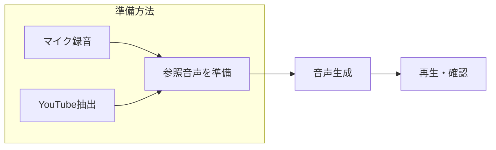

# Voice Clone ドキュメント

## 📚 ドキュメントインデックス

このディレクトリには Voice Clone プロジェクトのドキュメントが含まれています。

---

## 🚀 クイックスタート（最初の30分）

初めての方は以下の順番でお読みください：

1. **[環境構築ガイド](./guide/environment-setup.md)**（15分）
   - WSL2/WSLg のセットアップ
   - Python 環境の構築
   - オーディオ設定

2. **[クイックスタート](./guide/quick-start.md)**（5分）
   - 基本的な使い方
   - 録音 → 生成の流れ

3. **[TTS ガイド](./guide/tts.md)**（10分）
   - 音声生成の詳細
   - オプションとパフォーマンス

---

## 📁 ディレクトリ構成

```
docs/
└── guide/                    # ユーザー向けガイド
    ├── quick-start.md        # クイックスタート
    ├── environment-setup.md  # 環境構築
    ├── recording.md          # 録音ガイド
    ├── youtube-audio.md      # YouTube音声抽出
    └── tts.md                # TTS（音声生成）
```

---

## 🔍 目的別ガイド

### 環境を構築したい

| ドキュメント | 内容 |
|-------------|------|
| [環境構築ガイド](./guide/environment-setup.md) | WSL2、Python、オーディオ設定 |

### 参照音声を準備したい

| ドキュメント | 内容 |
|-------------|------|
| [録音ガイド](./guide/recording.md) | マイクで録音する方法 |
| [YouTube 音声抽出](./guide/youtube-audio.md) | YouTube から音声を取得 |

### 音声を生成したい

| ドキュメント | 内容 |
|-------------|------|
| [クイックスタート](./guide/quick-start.md) | 基本的な操作フロー |
| [TTS ガイド](./guide/tts.md) | 詳細な生成オプション |

### 開発に参加したい

| 参照先 | 内容 |
|--------|------|
| [CLAUDE.md](../CLAUDE.md) | プロジェクト全体のガイド |
| [src/voice_clone/](../src/voice_clone/) | ソースコード |

---

## 📖 ドキュメント一覧

### guide/ - ユーザーガイド

| ファイル | 概要 | 対象読者 |
|----------|------|----------|
| [environment-setup.md](./guide/environment-setup.md) | 環境構築の詳細手順 | 初回セットアップ |
| [quick-start.md](./guide/quick-start.md) | ツールの基本的な使い方 | 全員 |
| [recording.md](./guide/recording.md) | マイクでの録音方法、コツ | 自分の声を使いたい人 |
| [youtube-audio.md](./guide/youtube-audio.md) | YouTube からの音声抽出 | 既存の音声を使いたい人 |
| [tts.md](./guide/tts.md) | 音声生成の詳細、オプション | 全員 |

---

## 🛠 ワークフロー



### 典型的な流れ

1. **参照音声の準備**
   - 自分の声 → [録音ガイド](./guide/recording.md)
   - 既存の音声 → [YouTube 音声抽出](./guide/youtube-audio.md)

2. **音声生成**
   - [TTS ガイド](./guide/tts.md)

3. **確認・調整**
   - 再生して品質を確認
   - 必要に応じて参照音声を変更

---

## 🛠 今後追加予定

プロジェクトの成長に合わせて以下のドキュメントを追加予定：

- `knowledge/` - 実践的な知見（HOW）
  - TTS モデルのチューニング
  - 音声品質の改善テクニック
- `design/` - 設計思想（WHY）
  - アーキテクチャ決定の背景
- `references/` - 外部リファレンス
  - Qwen3-TTS の仕様
  - WSLg オーディオの詳細
